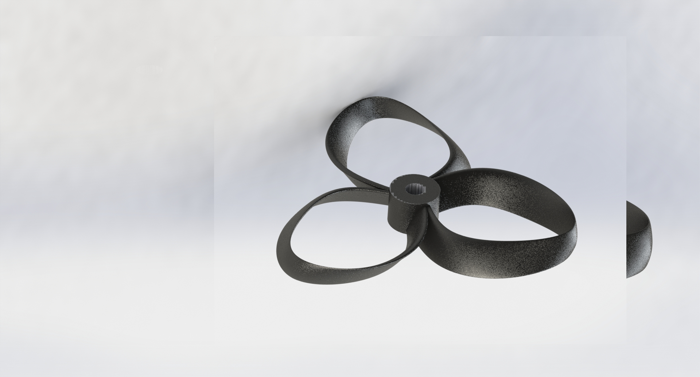
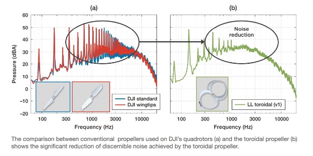

# Hawk-Eye   
#### innovation→material→manufacturing Material Used: Carbon Fiber Reinforced Plastics.

### Why Carbon Fiber Reinforced Plastics?

Carbon fiber-reinforced polymers (CFRPs) are increasingly replacing conventional metallic alloys in Aircraft/UAV structures. This is mainly due to the tensile strength carried by CFRP, which falls between 1500 and 3500 MPa, whereas its metallic counterparts, such as aluminum and steel, only possess tensile strengths of 450–600 MPa and 750–1500 MPa, respectively. Moreover, a relatively lower density at around 1.5 - 2.0 g/cm3 of CFRP makes it the ideal choice for being a major structural component of Aircraft/UAV.

### Manufacture Process: 3-D Printing How to Manufacture it?

Carbon fiber-reinforced plastic (CFRP) can be 3D printed using advanced additive manufacturing techniques. In this process, carbon fibers are combined with a thermoplastic or thermoset polymer resin to create a composite material that is then fed through a 3D printer. The printer uses a variety of techniques, such as fused deposition modeling (FDM) or continuous fiber 3D printing, to create the final part.

#### Here are some details of the 3D printer (in INDIA) from which we can manufacture our drone.

https://thefabmachines.com/f3series/
https://thefabmachines.com/g3series/
Propeller: Toroidal Propeller

### Why toroidal propellers over normal ones? (innovation)

Because: 
    
                                                 
Increased Thrust Efficiency
Improved Maneuverability
Reduced Noise and Vibration
Increased Safety

*taken from the references(3rd point) References :

1. https://thefabmachines.com/
2. [https://www.sciencedirect.com/topics/engineering/carbon-fibre-reinforced-polymer#:~:tex t=Moreover%2C%20a%20relatively%20lower%20density,major%20structural%20compo nent%20of%20aircrafts](https://www.sciencedirect.com/topics/engineering/carbon-fibre-reinforced-polymer#:~:text=Moreover%2C%20a%20relatively%20lower%20density,major%20structural%20component%20of%20aircrafts)
3. https://www.ll.mit.edu/doc/toroidal-propeller 
